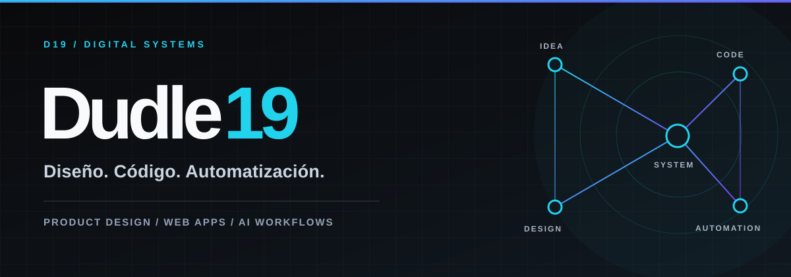

<div align="center">
  <a href="https://dudle19.com/"></a>

  <br>

  <strong>Diseño de producto · Desarrollo web · Automatización e IA</strong>

  <br><br>

  Soy Jesús E. Sánchez Cotto. Construyo experiencias digitales, sistemas web e integraciones que ayudan a convertir ideas y procesos complejos en productos claros y útiles.

  <br><br>

  <a href="https://dudle19.com/">Portafolio ↗</a> &nbsp;·&nbsp;
  <a href="mailto:hola@dudle19.dev">Hablemos ↗</a> &nbsp;·&nbsp;
  <a href="https://www.linkedin.com/in/jesus-e-s%C3%A1nchez-cotto-318889372/">LinkedIn ↗</a>
</div>

---

### 01 / Qué hago

| Producto y experiencia | Software e integraciones | Automatización e IA |
| :--- | :--- | :--- |
| UI/UX, identidad visual, sitios y páginas de conversión. | Aplicaciones web, paneles, CRM, APIs REST y sistemas a medida. | Flujos con n8n, webhooks, asistentes y herramientas para operaciones. |

Trabajo desde el diseño hasta la implementación, con atención a la experiencia móvil, la claridad de la interfaz y la arquitectura del producto.

### 02 / Trabajo seleccionado

| Proyecto | Enfoque | Ver |
| :--- | :--- | :--- |
| **Nameless Agency** | Identidad visual y presencia digital. | [Explorar ↗](https://dudle19.com/host/clients/nameless/) |
| **Marval Graphics** | Experiencia web para una marca creativa. | [Explorar ↗](https://marvalgraphics.com/) |
| **Rockola Virtual** | Producto interactivo para música y comunidad. | [Explorar ↗](https://rockola.twsears.com/) |
| **Mikaela** | Experiencia digital presentada en el portafolio. | [Explorar ↗](https://dudle19.com/host/proyects/mikaela) |
| **FirmaSigns** | Herramienta de firma de documentos. | [Explorar ↗](https://dudle19.com/host/proyects/pdfsigns/) |
| **AgentPlanner** | Herramienta para planificación y operación. | [Explorar ↗](https://twsears.com/agente/) |

También desarrollo conceptos y herramientas como **EasyPos**, **SocialAgent**, **Postmagic** y **FriendsPic**. [Ver el portafolio completo ↗](https://dudle19.com/#proyectos)

### 03 / Herramientas

```text
BACKEND        PHP modular · MySQL · APIs REST
FRONTEND       HTML · CSS · JavaScript · React · Tailwind
AUTOMATIZACIÓN n8n · Webhooks · OpenAI API · Gemini
DISEÑO         Figma · Photoshop · Illustrator · After Effects
```

### 04 / En contacto

¿Tienes una idea, un proceso que necesita mejorar o un producto por construir? Escríbeme a **[hola@dudle19.dev](mailto:hola@dudle19.dev)**.

<div align="center">
  <a href="https://dudle19.com/">Web</a> &nbsp;·&nbsp;
  <a href="https://www.linkedin.com/in/jesus-e-s%C3%A1nchez-cotto-318889372/">LinkedIn</a> &nbsp;·&nbsp;
  <a href="https://www.twitch.tv/dudle19">Twitch</a> &nbsp;·&nbsp;
  <a href="https://www.youtube.com/@ElDudle_">YouTube</a> &nbsp;·&nbsp;
  <a href="https://www.tiktok.com/@eldudle19">TikTok</a>

  <br><br>

  <sub>Dudle19 · Diseño, código y automatización</sub>
</div>
